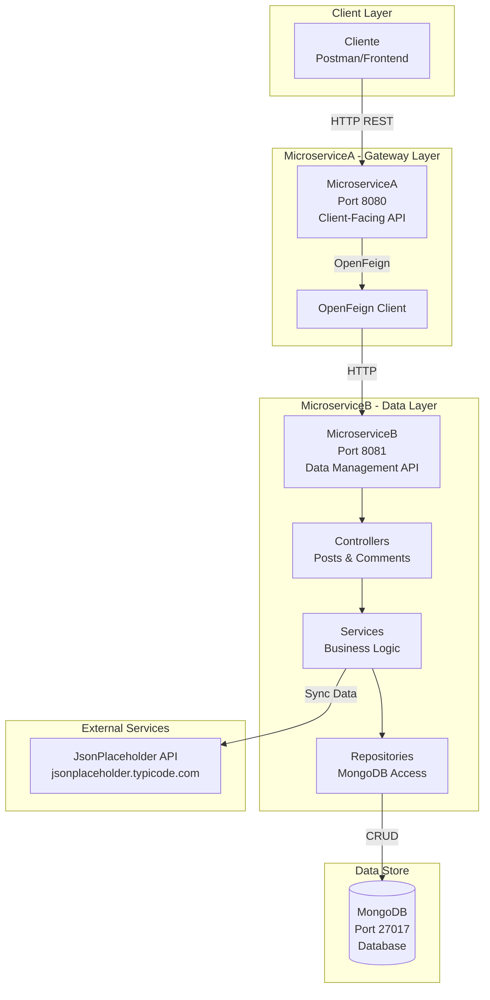
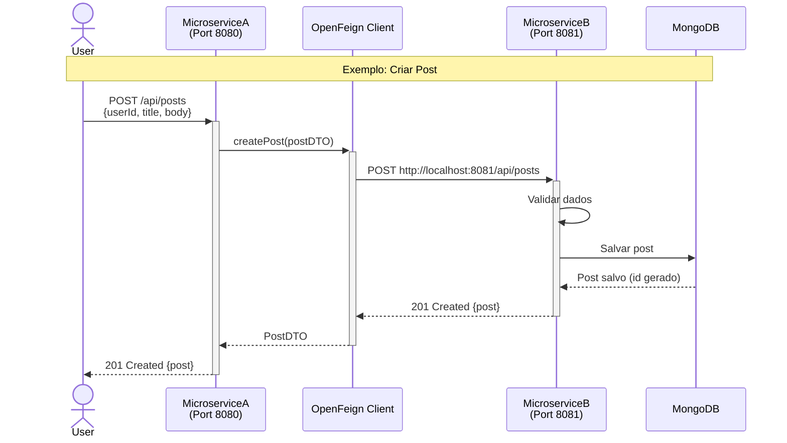
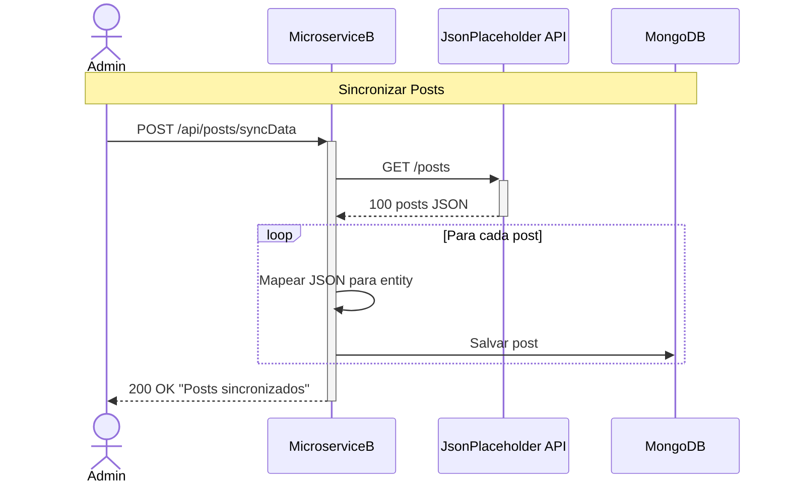

# Serviços Distribuídos com Spring

[](https://www.oracle.com/java/)
[](https://spring.io/projects/spring-boot)
[](https://www.mongodb.com/)
[](https://spring.io/projects/spring-cloud-openfeign)
[](https://maven.apache.org/)
[](https://swagger.io/)

Arquitetura de microsserviços distribuídos usando Spring Boot e MongoDB. Demonstra comunicação entre serviços via OpenFeign, sincronização de dados com API externa (JsonPlaceholder), e gerenciamento de posts e comentários com persistência NoSQL.

---

## Funcionalidades

### Gerenciamento de Posts
- Sincronização de posts da API JsonPlaceholder
- CRUD completo: Criar, listar, buscar, atualizar e deletar posts
- Persistência em MongoDB

### Gerenciamento de Comentários
- Sincronização de comentários da API JsonPlaceholder
- CRUD completo: Criar, listar, buscar, atualizar e deletar comentários
- Relacionamento com posts

### Arquitetura Distribuída
- Comunicação entre serviços via OpenFeign
- Separação de responsabilidades: Gateway vs Data Service
- Integração com API externa (JsonPlaceholder)
- Banco de dados NoSQL (MongoDB)

---

## Arquitetura

### Arquitetura de Microsserviços



### Comparação dos Microsserviços

| Aspecto | MicroserviceA (Gateway) | MicroserviceB (Data API) |
|---------|-------------------------|--------------------------|
| **Porta** | 8080 | 8081 |
| **Propósito** | Cliente externo, gateway | Lógica de dados e persistência |
| **Responsabilidades** | Receber requisições, delegar para B | CRUD, sync com JsonPlaceholder, MongoDB |
| **Banco de Dados** | Não acessa diretamente | MongoDB (posts, comments) |
| **Comunicação** | OpenFeign (cliente HTTP) | REST API (servidor) |
| **Dependências** | MicroserviceB | MongoDB, JsonPlaceholder API |

### Fluxo de Comunicação (OpenFeign)



### Fluxo de Sincronização de Dados



---

## Tecnologias

### Backend

| Tecnologia | Versão | Propósito |
|------------|--------|-----------|
| Java | 17 | Linguagem de programação |
| Spring Boot | 3.4.0 | Framework de aplicação |
| Spring Web | 6.x | APIs REST |
| Spring Data MongoDB | 4.x | Persistência NoSQL |
| Spring Cloud OpenFeign | 4.x | Comunicação entre microsserviços |
| Maven | 3.6+ | Build e gerenciamento de dependências |

### Banco de Dados

| Tecnologia | Versão | Propósito |
|------------|--------|-----------|
| MongoDB | 4.4+ | Banco de dados NoSQL document-oriented |

---

## Uso

### Executando os Serviços

> **IMPORTANTE:** Execute sempre MicroserviceB **antes** de MicroserviceA, pois A depende de B.

#### Terminal 1: MicroserviceB

```bash
cd microserviceB
mvn spring-boot:run
```

#### Terminal 2: MicroserviceA

```bash
cd microserviceA
mvn spring-boot:run
```

### Setup Inicial de Dados

Após iniciar ambos os serviços, sincronizar dados do JsonPlaceholder:

```bash
# 1. Sincronizar posts (100 posts)
curl -X POST http://localhost:8081/api/posts/syncData

# 2. Sincronizar comentários (500 comments)
curl -X POST http://localhost:8081/api/posts/syncDataComments

# 3. Verificar dados no MongoDB
mongo Desafio2_Lord-of-Springs
db.posts.count()        # Deve retornar 100
db.comments.count()     # Deve retornar 500
```

### Exemplos de Uso

#### 1. Listar todos os posts

```bash
curl http://localhost:8080/api/posts
```

#### 2. Buscar post por ID

```bash
curl http://localhost:8080/api/posts/1
```

#### 3. Criar novo post

```bash
curl -X POST http://localhost:8080/api/posts \
  -H "Content-Type: application/json" \
  -d '{
    "userId": 1,
    "title": "Meu novo post",
    "body": "Este é o conteúdo do meu post"
  }'
```

#### 4. Atualizar post

```bash
curl -X PUT http://localhost:8080/api/posts/101 \
  -H "Content-Type: application/json" \
  -d '{
    "userId": 1,
    "title": "Post atualizado",
    "body": "Conteúdo modificado"
  }'
```

#### 5. Deletar post

```bash
curl -X DELETE http://localhost:8080/api/posts/101
```

---

## API Endpoints

### MicroserviceA (Port 8080) - Gateway

> Todos os endpoints delegam para MicroserviceB via OpenFeign

#### Posts

| Método | Endpoint | Descrição |
|--------|----------|-----------|
| `GET` | `/api/posts` | Listar todos os posts |
| `GET` | `/api/posts/{id}` | Buscar post por ID |
| `POST` | `/api/posts` | Criar novo post |
| `PUT` | `/api/posts/{id}` | Atualizar post |
| `DELETE` | `/api/posts/{id}` | Deletar post |

#### Comments

| Método | Endpoint | Descrição |
|--------|----------|-----------|
| `GET` | `/api/comments` | Listar todos os comentários |
| `GET` | `/api/comments/{id}` | Buscar comentário por ID |
| `POST` | `/api/comments` | Criar novo comentário |
| `PUT` | `/api/comments/{id}` | Atualizar comentário |
| `DELETE` | `/api/comments/{id}` | Deletar comentário |

---

### MicroserviceB (Port 8081) - Data API

#### Posts

| Método | Endpoint | Descrição |
|--------|----------|-----------|
| `POST` | `/api/posts/syncData` | Sincronizar posts do JsonPlaceholder |
| `GET` | `/api/posts` | Listar todos os posts |
| `GET` | `/api/posts/{id}` | Buscar post por ID |
| `POST` | `/api/posts` | Criar novo post |
| `PUT` | `/api/posts/{id}` | Atualizar post |
| `DELETE` | `/api/posts/{id}` | Deletar post |

#### Comments

| Método | Endpoint | Descrição |
|--------|----------|-----------|
| `POST` | `/api/posts/syncDataComments` | Sincronizar comentários do JsonPlaceholder |
| `GET` | `/api/comments` | Listar todos os comentários |
| `GET` | `/api/comments/{id}` | Buscar comentário por ID |
| `POST` | `/api/comments` | Criar novo comentário |
| `PUT` | `/api/comments/{id}` | Atualizar comentário |
| `DELETE` | `/api/comments/{id}` | Deletar comentário |

---

## Estrutura do Projeto

```
distributed-services-spring/
├── microserviceA/                 # Gateway Service
│   ├── src/main/java/
│   │   ├── controller/            # REST Controllers
│   │   ├── feign/                 # OpenFeign Clients
│   │   ├── dto/                   # Data Transfer Objects
│   │   └── MicroserviceAApp.java
│   └── pom.xml
│
├── microserviceB/                 # Data Service
│   ├── src/main/java/
│   │   ├── controller/            # REST Controllers
│   │   ├── service/               # Business Logic
│   │   ├── repository/            # MongoDB Repositories
│   │   ├── model/                 # Entities
│   │   └── MicroserviceBApp.java
│   └── pom.xml
│
└── swagger.json                   # API Documentation
```

---

## Contribuidores

Este projeto foi desenvolvido por:

- Gabriel Felipe Birck
- Guilherme Marschall
- João Pedro Ferreira Ponchiroli
- Matheus Gotardo Reato
- Ruan Carlos Dalla Rosa
